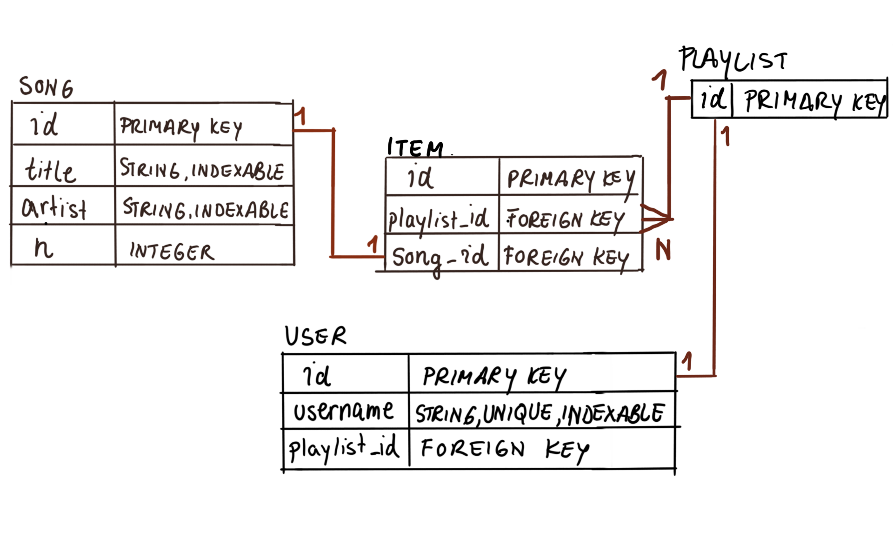

## FlaskFM Webservice 
I have attached required dependencies to run the webservice locally on your machine you can find it in `requirements.txt` file.

To install dependencies run this command on your terminal:

`pip install -r requirements.txt`

Now you have to initialize the database using the ***predefined model** and then add demo data, to achieve that you should run `add_data.py` script on terminal:

`python add_data.py`

* You can check database schema that we will create on the image `songs-shcema`.

After running `add_data.py` flask webservice database is ready. feel free to add any data you want to the database to test the service.

You need to set `FLASK_APP` environment variable to load the webservice:

Run CMD command:

`set FLASK_APP=app`

Or run Powershell command:

`$env:FLASK_APP = "app"`

You can run flask webservice on your local host by executing this command on your terminal:

`flask run`

It will run on http://127.0.0.1:5000

**FlaskFM** is a webservice to manage songs library

The main functionalities of webservice:

* Show List of current users of the service.
* Show profile page for a user with his current playlist.
* Add new song to user playlist.
* Delete song from user playlist.
* Add new song to the library using admin dashboard.
* Sort songs according to its popularity (number of users added the song to their playlist) on the admin dashboard. 

**Made with ❤ by Mohamad Oghli**

Email: `mhd.sh.oghli@gmail.com`